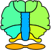
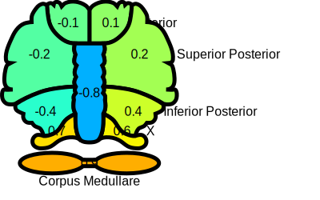
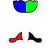
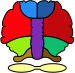
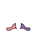

Examples
========

Format of the input file
------------------------

The input file should a ``.csv`` file with two columns. The first column is
"name", and the second is "value". See the following sections for examples. The
"value" column is mapped to some colors and shown on the region which is
specified by the corresponding "name".

To show a file of p-values, see the section :ref:`Convert p-values into
significance levels` and :py:func:`cerebellum_value_map.convert_pvals` for more
details.

Default colormaps
-----------------

**Continuous colormap**: `jet <https://matplotlib.org/3.1.0/tutorials/colors/colormaps.html>`_.

**Discrete colormap**:

+-----+--------------+
|Value|RGB color     |
+=====+==============+
| 0   |255, 255, 255 |
+-----+--------------+
| 1   |255, 225, 25  |
+-----+--------------+
| 2   |245, 130, 49  |
+-----+--------------+
| 3   |230, 25, 75   |
+-----+--------------+
|-1   |66, 212, 244  |
+-----+--------------+
|-2   |67, 99, 216   |
+-----+--------------+
|-3   |70, 153, 144  |
+-----+--------------+

Commands
--------

Print help
^^^^^^^^^^

.. code-block:: bash

   show_cerebellum.py -h

Show values with a continuous colormap
^^^^^^^^^^^^^^^^^^^^^^^^^^^^^^^^^^^^^^

.. code-block:: bash

    show_cerebellum.py -i sample_data/data_lobe.csv \
        -o example_continuous_colormap.svg -M continuous # jet colormap

.. note::

    The first column of the input file should be the same with the following
    sample file to output a **lobe** illustration.

The `sample_data/data_lobe.csv <https://github.com/shuohan/cerebellum-value-map/blob/develop/sample_data/data_lobe.csv>`__
in this example:

.. code-block:: text

   name,value
   Right Anterior,0.1
   Left Anterior,-0.1
   Right Superior Posterior,0.2
   Left Superior Posterior,-0.2
   Right Inferior Posterior,0.4
   Left Inferior Posterior,-0.4
   Right X,0.6
   Left X,0.7
   Vermis,-0.8
   Corpus Medullare,0.9

Show values with a discrete colormap
^^^^^^^^^^^^^^^^^^^^^^^^^^^^^^^^^^^^

.. code-block:: bash

    show_cerebellum.py -i sample_data/data_lobule.csv \
        -o example_discrete_colormap.svg -M discrete

.. note::

    The first column of the input file should be the same with the following
    sample file to output a **lobule** illustration.

The `sample_data/data_lobule.csv <https://github.com/shuohan/cerebellum-value-map/blob/develop/sample_data/data_lobule.csv>`__
in this example:

.. code-block:: text

   name,value
   Corpus Medullare,1
   Left I-III,-1
   Right I-III,2
   Left IV,3
   Right IV,-2
   Left V,-3
   Right V,0
   Vermis VI,0
   Left VI,1
   Right VI,2
   Vermis VII,-2
   Left Crus I,-3
   Left Crus II,1
   Left VIIB,2
   Right Crus I,0
   Right Crus II,1
   Right VIIB,-3
   Vermis VIII,-2
   Left VIIIA,1
   Left VIIIB,2
   Right VIIIA,3
   Right VIIIB,0
   Vermis IX,-3
   Left IX,-1
   Right IX,2
   Vermis X,1
   Left X,3
   Right X,1

Convert p-values into significance levels
^^^^^^^^^^^^^^^^^^^^^^^^^^^^^^^^^^^^^^^^^

The conversion logic:
* :math:`p \in (0.05, 1]` is converted into value 0
* :math:`p \in (0.01, 0.05]` is converted into value 1
* :math:`p \in (0.01, 0.001]` is converted into value 2
* :math:`p \in (0.001, \infty]` is converted into value 3

These values are then converted into colors according to the
:ref:`default colormap <Default colormaps>`.

It is possbile to include a "sign" to each p-value. This can be used when, for
example, the correlations are measured, and you want to indicate positive or
negative correlations with the illustration. See the documentation of the
function :py:func:`cerebellum_value_map.convert_pvals` for more details.

.. code-block:: bash

    show_cerebellum.py -i sample_data/pvals.csv -o example_pvals.svg -p

The `sample_data/pvals.csv <https://github.com/shuohan/cerebellum-value-map/blob/develop/sample_data/pvals.csv>`__
in this example is:

.. code-block:: text

    name,pval,sign
    Right Anterior,0.03,1
    Left Anterior,0.001,-1
    Right Superior Posterior,0.04,-1
    Left Superior Posterior,0.02,1
    Right Inferior Posterior,0.009,-1
    Left Inferior Posterior,0.004,1
    Right X,0.001,-1
    Left X,3.4E-4,1
    Vermis,9.1E-4,-1
    Corpus Medullare,1.3E-10,1

Change appearance and show annotations
^^^^^^^^^^^^^^^^^^^^^^^^^^^^^^^^^^^^^^

.. code-block :: bash

    show_cerebellum.py -i sample_data/data_lobe.csv -o example_scale_annot.svg \
        -M continuous -w 5 -s 400 250 -S 0.6 -f 16 -a -T

Change continuous colormap
^^^^^^^^^^^^^^^^^^^^^^^^^^

.. code-block:: bash

    show_cerebellum.py -i sample_data/data_lobe.csv \
    -o example_custom_continuous.svg -M continuous -c viridis -v -1 -V 1

Change discrete colormap
^^^^^^^^^^^^^^^^^^^^^^^^

.. code-block:: bash

    show_cerebellum.py -i data.csv -o example_custom_discrete.svg \
        -M discrete -C colormap.txt

See the documnetation of the class
:py:class:`cerebellum_value_map.DiscreteColors` for more details of the file
format of the ``colormap.txt`` file.

The ``data.csv`` used in this example:

.. code-block:: text

    name,value
    Right Anterior,2
    Left Anterior,3
    Right X,0
    Left X,1

The ``colormap.txt`` used in this example:

.. code-block:: text

    0 0 0 0
    1 255 0 0
    2 0 255 0
    3 0 0 255

Show a label map with pre-defined colors
^^^^^^^^^^^^^^^^^^^^^^^^^^^^^^^^^^^^^^^^

This mode is used to illustration the region definition as in the top-right of
Fig.2. in the paper `Longitudinal analysis of regional cerebellum volumes
during normal aging <https://www.sciencedirect.com/science/article/pii/S1053811920305486?via%3Dihub>`__.

Lobe illustration:

.. code-block:: bash

    show_cerebellum.py -o example_label_lobe.svg -l -m lobe

Lobule illustration:

.. code-block:: bash

    show_cerebellum.py -o example_label_lobule.svg -l

Change the pre-defined label colors
^^^^^^^^^^^^^^^^^^^^^^^^^^^^^^^^^^^

.. code-block:: bash

    show_cerebellum.py -o example_custom_labels.svg \
        -l -m lobe -C colormap_label.txt -n "Left X" "Right X"

Use the option ``-n`` to show a subset of the regions.

The ``colormap_label.txt`` in this example is:

.. code-block:: text

      0     0     0     0    "Clear Label"
     10   199   176   211    "Vermis"
     12   199   156   149    "Corpus Medullare"
     31   172   199   230    "Left Anterior"
     32   255   126    42    "Right Anterior"
     61   255   186   127    "Left Superior Posterior"
     62   0     160    58    "Right Superior Posterior"
     81   141   223   144    "Left Inferior Posterior"
     82   223    35    45    "Right Inferior Posterior"
    103   255   151   151    "Left X"
    106   153   103   185    "Right X"

Customize the shapes
--------------------

It is possible to customize the shapes, for example, when you want to merge two
regions together. When I created these illustraitions, I used some software to
draw the SVG shapes then copied their path code (something like "M 100, 100 L
100, 120 L 120, 120 Z") into :py:function`create_region`. Here is an example of
how to show these customzied shapes:

.. literalinclude:: ../../tests/test_other_shapes.py

