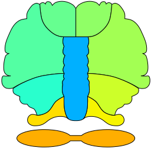
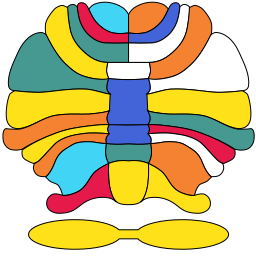

Cerebellum Value Map
====================

This package can show values as colors on top of a cerebellum
illustration:

.. toctree::
   :maxdepth: 2
   :caption: Contents:
    
   api
   examples

Index
-----

* :ref:`genindex`
